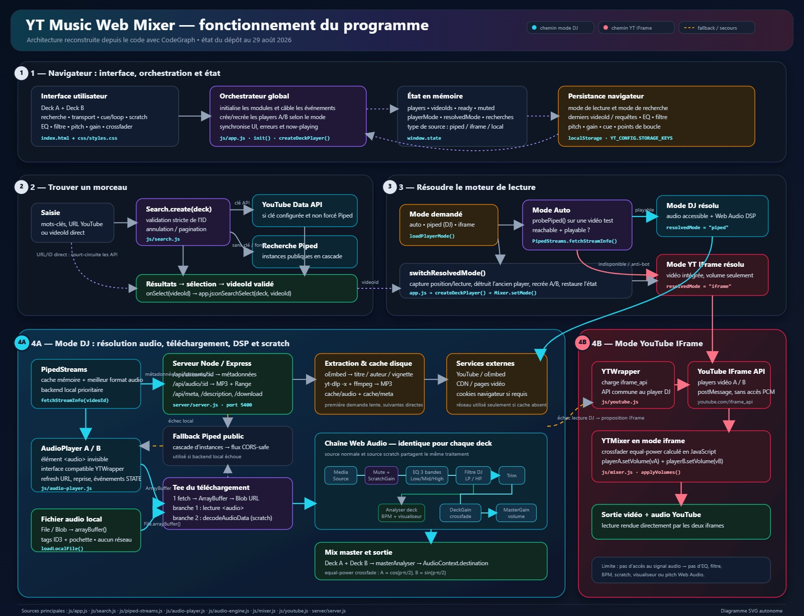

# 🎵 YT Music Web Mixer

Application web en HTML + JS pur permettant de charger 2 morceaux YouTube côte à côte (voies **A** et **B**) et de les mixer via un **crossfader** en bas de page.

L'utilisation recommandée passe par le serveur Express local et `yt-dlp` : le serveur extrait et relaie le flux audio, ce qui permet au lecteur d'utiliser le **mode DJ** avec les traitements Web Audio. Un fallback IFrame reste disponible lorsque l'extraction audio est indisponible.

> ⚠️ En **mode IFrame**, le mixage est uniquement un **crossfade de volumes**. En **mode DJ**, le flux audio extrait peut être traité par la Web Audio API (EQ, filtres, analyse et fonctions liées au tempo).

---

## ✨ Fonctionnalités

- **2 voies côte à côte** (A à gauche, B à droite), chacune avec son lecteur et sa barre de recherche.
- **Mode DJ** : backend Express local + extraction `yt-dlp`, relais audio same-origin et traitements Web Audio pour le vrai crossfade audio, l'EQ, le trim de gain par voie, les filtres, l'analyse et le scratch. Si le backend local est indisponible, le lecteur peut utiliser les flux audio des instances Piped lorsque le CORS le permet.
- **Recherche YouTube** par mot-clé **sans clé API** grâce à l'API publique [Piped](https://docs.piped.video/) (frontend YouTube alternatif, CORS activé, pas de quota Google). Plusieurs instances Piped sont essayées en cascade pour la fiabilité. Une clé API YouTube Data reste optionnelle pour des résultats plus pertinents et la pagination officielle. Saisie manuelle d'une URL / ID vidéo également possible.
- **Bouton de bascule de mode de recherche** : quand une clé API est configurée, un bouton 🟢/⚪ permet de forcer la recherche via Piped (préserve le quota Google) ou de revenir à l'API YouTube Data officielle. Le choix est persisté en `localStorage`.
- **Panneau de résultats** : boutons de pagination précédent/suivant et bouton `▲`/`▼` dans la barre de pagination pour replier ou déployer les résultats sans supprimer leur contenu. Le bouton existant `✕` efface toujours la requête et les résultats.
- **Popup d'information au survol d'un résultat** : après ~500 ms de survol d'une carte résultat, une info-bulle affiche les **vues**, la **date de publication** (formatée proprement — « il y a 3 mois » pour du récent, « le 21/01/2003 » pour de l'ancien, les timestamps aberrants type `-1` sont rejetés) et la **description YouTube complète** (celle du « more » / détails : tracklist, liens, crédits). La description est récupérée en priorité depuis le backend local (`/api/description/:id`, via `yt-dlp --print description`, cache serveur 24 h), avec fallback API YouTube Data puis Piped. Le popup reste visible **4 s** après la sortie de la carte (survol du popup = délai annulé) pour permettre de **sélectionner/copier** son texte ; un clic en dehors le ferme immédiatement. Un debounce 500 ms évite les rafales de requêtes lors du balayage de la grille.
- **Détection des live streams** : les résultats en direct affichent un badge **🔴 EN DIRECT** (à la place de la durée) et le popup porte le même badge. Le clic sur un live demande **confirmation** avant chargement (« le chargement peut être long ou indéfini ») — un live n'a pas de fin et l'extraction serveur téléchargerait indéfiniment.
- **Lien YouTube par résultat** : chaque carte porte une petite icône ▶ rouge (bouton play YouTube, ~18×13 px) qui ouvre la vidéo sur youtube.com dans un nouvel onglet, après confirmation. L'ID de la vidéo n'apparaît que dans le tooltip de l'icône et l'`aria-label` (pas dans la carte, pour préserver la place du titre). Le clic sur l'icône ne charge pas le morceau dans le deck.
- **Bandeau now-playing enrichi** : le bandeau du morceau courant (`.deck-nowplaying`) affiche deux boutons alignés à droite — le bouton **YouTube ▶** (même apparence que celui des vignettes : lien complet `https://www.youtube.com/watch?v=<id>`, confirmation avant ouverture) et un bouton **info « ! »** qui ouvre la **description complète du morceau** dans un popup overlay. Le popup est attaché au `<body>` (`position: fixed`, `z-index: 1000`) pour passer **toujours au premier plan** (au-dessus de la platine de scratch et de l'analyseur), sa hauteur est limitée à **500 px** (corps scrollable), et il se ferme par le bouton **✕** en haut à droite ou par **Échap**. La description est chargée **une seule fois par morceau** (cache mémoire) via `/api/description/:id` (même pipeline que le popup de recherche) et le popup est reconstruit proprement à chaque changement de morceau (aucun doublon entre les voies A/B ni entre deux morceaux successifs).
- **Métadonnées popup en cache (zéro requête répétée)** : vues, date de publication et description complète affichées au survol viennent d'un **cache disque** (`cache/meta/<id>.json`). Chaque info est récupérée **UNE seule fois** côté serveur (oEmbed rapide + un léger `yt-dlp --skip-download` pour vues/date/description), puis servie depuis le disque — plus de requête upstream répétée ni de `yt-dlp` à chaque survol. `/api/streams/:id` renvoie aussi ces champs → le popup s'affiche **sans requête réseau supplémentaire** une fois le morceau chargé.
- **Enrichissement du MP3 sauvé** (`💾 Save local`) : en plus du titre/artiste/date/genre/pochette (APIC), le MP3 du cache reçoit un **commentaire ID3 compact** (`YTWM:` JSON avec id vidéo, durée, date ISO — **sans le nombre de vues**, inutile dans un fichier audio). L'enrichissement se fait en tâche de fond, sans ré-encodage, la **pochette APIC est conservée telle quelle**.
- **Robustesse de la recherche** : les IDs vidéo sont validés strictement (11 caractères, rejet des mots de requête tout-minuscules comme « groundation » qui peuvent fuiter d'une instance Piped défaillante) au moment de la normalisation des résultats, au clic, et à la restauration du dernier morceau au démarrage — une requête de recherche ne peut plus jamais être envoyée à `/api/streams/:id` comme si c'était un ID.
- **Trim de gain par voie** (±10 dB, neutre à 0 dB) avant le crossfader, avec affichage dB en temps réel, persistance, reset par double-clic et bouton dédié `↺`.
- **Scratch / platine** en mode DJ : décodage paresseux du buffer complet, scratch bidirectionnel, release conservant la position et logs de debug réduits (les jalons importants d'engage/release restent visibles).
- **Sauvegarde locale (`💾 Save local`)** en mode DJ : chaque voie expose un bouton `💾 Save local` à droite de `📁 Load local`. Il sauvegarde le MP3 en cours de lecture sur le disque via le dialogue standard du navigateur (`showSaveFilePicker`, fallback `<a download>`). Le nom proposé est `<titre>-<artiste>.mp3`, et le fichier embarque les métadonnées YouTube (titre, artiste, date, genre…) **ainsi que la pochette** (APIC/ID3, écrite côté serveur) et un **commentaire ID3 compact** (`YTWM:` JSON avec id, durée, date ISO — pas de vues). Le bouton est désactivé pour une source locale (fichier déjà sur disque) et en mode IFrame.
- **Crossfader A↔B** (0 = full A, 100 = full B, 50 = équilibré) avec courbe *equal-power* pour éviter le creux de niveau au milieu.
- **Volume master** global (0–100%).
- **Boutons mute/unmute par voie** (obligatoire pour contourner les politiques d'autoplay des navigateurs).
- **Contrôles de lecture** : *play both* / *pause both*, plus bouton lecture/pause par voie.
- **Sauvegarde locale du morceau courant (`💾 Save local`)** : dans chaque voie, un bouton `💾 Save local` (à droite de `📁 Load local`) enregistre le MP3 en cours de lecture sur votre disque. Le nom proposé est `<titre>-<artiste>.mp3` et le fichier embarque les métadonnées YouTube (titre, artiste, album, date, genre…) **ainsi que la pochette** (APIC/ID3 écrite côté serveur avec `ffmpeg`). Fonctionne en **mode DJ** sur une source YouTube ; désactivé pour un fichier déjà local.
- **Sync B → A** : aligner B sur la position de A (ponctuel ou continu).
- **Démutage automatique au changement de vidéo** : la sélection d'un nouveau morceau active le son automatiquement (le clic compte comme geste utilisateur pour les politiques d'autoplay).
- **Affichage séparé des volumes A/B** : la barre de crossfade affiche le pourcentage de volume de chaque voie individuellement.
- **Curseur de crossfade style mixage** : rectangle 15×30px avec curseur `ew-resize`, comme un fader de console matérielle.
- **Contrôles DJ (mode Piped/DSP uniquement)** :
  - **EQ 3 bandes** (Low / Mid / High, ±12 dB) par voie avec affichage dB en temps réel, double-clic pour réinitialiser et bouton dédié `↺`.
  - **Filtre DJ** sweep (lowpass ↔ highpass, knob log-scale) par voie avec affichage `LP x%` / `HP x%` / `OFF` en temps réel et retour au bypass.
  - **Slider pitch / tempo** (±8%) par voie avec `preservesPitch` (changement de tempo sans changement de hauteur), reset double-clic, l'afficheur BPM montre le BPM *effectif* (`bpm × playbackRate`).
  - **Boutons RAZ** (↺) à côté de chaque slider vertical DJ pour un reset en un clic à la valeur neutre.
  - **Détection BPM temps réel** par voie (spectral-flux onset + histogramme des intervalles inter-beat, verrouillage après cycles stables). Trois états visuels : **rouge** pendant l'acquisition (`idle`/`detecting`), **orange** dès qu'un BPM provisoire est disponible (~2-3 s, état `estimating`), **vert** quand la valeur est verrouillée (`locked`). Le BPM provisoire est calculé par médiane des intervalles et s'affiche tôt, puis l'histogramme continue d'affiner en arrière-plan jusqu'au verrouillage. Le bouton **RAZ** (↺) sous la valeur reste toujours visible pour relancer le calcul. La valeur verrouillée ne se met à jour qu'en cas de vrai changement (>3%) pour éviter le clignotement.
  - **Bouton SYNC** pour matcher le tempo de la voie B sur la voie A (limité à ±8%, répercuté sur le slider de pitch).
  - **Visualiseurs spectre/waveform** par voie + spectre master dans la barre de mixage (via `AnalyserNode`, 30+ FPS).
- **Persistance** via `localStorage` : clé API, dernières requêtes, derniers videoIds, trim de gain, EQ, filtre DJ et pitch par voie sont sauvegardés et restaurés au reload et à la bascule de mode.
- **Scripts de lancement en un clic** : `start.sh` (macOS/Linux/WSL) et `start.bat` (Windows) démarrent le serveur Express local sur le port 5400 et ouvrent l'app dans le navigateur par défaut.
- **Script d'installation Windows (`install.bat`)** : double-cliquez dessus après le `git clone` pour installer automatiquement **Git, Node.js LTS, yt-dlp nightly, ffmpeg/ffprobe** et les dépendances npm du projet (via `winget` ou PowerShell en fallback).
- **Responsive** : passe en une colonne sur petit écran.

---

## 🚀 Démarrage

### 1. Installation

> 🚀 **Sur Windows ?** La méthode la plus simple est de **double-cliquer sur `install.bat`** (à la racine du projet, après le `git clone`) : il installe **Git, Node.js LTS, yt-dlp nightly et ffmpeg/ffprobe** automatiquement (via `winget` ou PowerShell en fallback), puis lance `npm install`. Une fois `install.bat` terminé, lancez `start.bat` pour démarrer l'app. Tout ce qui suit (sous-rubriques 1.1 → 1.5) est la version **détaillée / manuelle** : utile pour comprendre ce que `install.bat` fait sous le capot, ou si vous voulez installer les dépendances une par une (par exemple sur macOS/Linux, ou si `install.bat` n'est pas applicable dans votre environnement).

Cette section décrit comment **récupérer le code** et **installer les dépendances** (Node.js, `yt-dlp`, `ffmpeg`) — l'accent est mis sur **Windows**, qui n'a aucun de ces outils préinstallés. Sur macOS ou Linux, les sous‑sections `Windows` sont simplement à ignorer.

#### 1.1 Récupérer le projet (Git)

La méthode recommandée est de cloner le dépôt avec **Git** : vous pourrez ensuite récupérer les mises à jour avec un simple `git pull`. Si vous n'avez pas Git, voyez la sous‑section « Installer Git » ci‑dessous.

```bash
git clone https://github.com/agaldemas/yt-music-web-mixer.git
cd yt-music-web-mixer
```

> 💡 Vous n'avez pas de compte GitHub ? Aucun souci, le clonage ci‑dessus lit le dépôt **en lecture seule** — aucune authentification n'est demandée.

##### Installer Git

**Windows** — installez **Git for Windows** (fournit Git Bash, l'explorateur de contexte et `git` en ligne de commande) :

1. Téléchargez l'installeur sur <https://git-scm.com/download/win>.
2. Lancez l'exécutable `.exe` téléchargé. Laissez les options par défaut (ajout au PATH, intégration à l'Explorateur, fin de ligne LF/CRLF auto — important si vous touchez au code).
3. Ouvrez une nouvelle fenêtre `PowerShell` ou `Git Bash` et vérifiez :

    ```powershell
    git --version
    ```

    Doit afficher `git version 2.x`. Si Windows vous demande de confirmer l'ajout au PATH, faites‑le.

**macOS** — Xcode Command Line Tools suffisent :

```bash
xcode-select --install   # une seule fois
git --version
```

**Linux (Debian/Ubuntu)** :

```bash
sudo apt update && sudo apt install -y git
git --version
```

#### 1.2 Installer Node.js (Windows) — uniquement pour faire tourner ce projet

> Le projet a besoin de **Node.js 22.12+** ou **24 LTS** (cf. `package.json` → `engines.node`). On **n'utilise pas npm pour installer Node** — npm est livré *avec* Node, donc il suffit d'installer Node et npm suit automatiquement.

**Méthode recommandée : installeur officiel Windows (.msi)**

1. Allez sur <https://nodejs.org/en/download> et téléchargez l'installeur **Windows Installer (.msi)** de la branche **LTS** (recommandé) ou, si vous savez ce que vous faites, **Current** (≥ 22.12).
2. Lancez le `.msi`. Dans l'écran **Custom Setup**, vérifiez que **« Add to PATH »** et **« npm package manager »** sont cochés, puis cliquez **Next → Install**.
3. À la fin, laissez **« Install additional tools for native modules »** coché si on vous le propose (facultatif mais utile).

**Méthode alternative (sansinstalleur, pour utilisateurs avancés) — winget / Chocolatey / Scoop**

```powershell
# winget (intégré à Windows 10/11 récent)
winget install -e --id OpenJS.NodeJS.LTS

# Chocolatey (admin PowerShell)
choco install nodejs-lts

# Scoop
scoop install nodejs-lts
```

##### Vérification

**Ouvrez une nouvelle fenêtre PowerShell** (les PATH modifiés ne s'appliquent qu'aux nouveaux shells), puis :

```powershell
node --version    # doit afficher v22.12.x ou v24.x.x
npm --version     # doit afficher une version ≥ 10
where.exe node    # doit afficher le chemin du binaire
```

> ⚠️ Si `node` n'est pas reconnu, fermez **toutes** les fenêtres PowerShell/VS Code/Explorateur ouvertes et rouvrez‑en une. Les PATH modifiés ne sont propagés qu'au prochain login shell.

> ⚠️ **Important pour ce projet** : n'installez **pas** Node via le Microsoft Store sur Windows (le PATH est virtuel, certainsextensions ne le trouvent pas, et le projet refuse de démarrer). Préférez l'installeur `.msi`, `choco`, `scoop` ou `winget` comme ci‑dessus.

##### Pour macOS / Linux (rappel rapide)

- **macOS** : `brew install node` (Homebrew installe Node LTS + npm).
- **Linux (Debian/Ubuntu)** : `sudo apt install -y nodejs npm`, ou Nodesource (recommandé pour une version récente) :

    ```bash
    curl -fsSL https://deb.nodesource.com/setup_22.x | sudo -E bash -
    sudo apt install -y nodejs
    ```

#### 1.3 Installer `yt-dlp` et `ffmpeg`

Ces deux binaires sont **indispensables au mode DJ** (extraction + conversion audio).

##### Windows

**Option recommandée — `winget`** (le plus simple, met à jour automatiquement) :

```powershell
winget install -e --id yt-dlp.yt-dlp
winget install -e --id Gyan.FFmpeg
```

**Option installeur manuel `yt-dlp`** :

1. Téléchargez `yt-dlp.exe` depuis la page **Windows (exe)**: <https://github.com/yt-dlp/yt-dlp/releases/latest> (ou la nightly : <https://github.com/yt-dlp/yt-dlp-nightly-builds/releases/latest>).
2. Placez l'exécutable dans un dossier déjà dans votre `PATH` (le plus simple : `C:\Users\<vous>\bin\`) **ou** ajoutez son dossier au `PATH` utilisateur :
    - Panneau de configuration → Système → Paramètres système avancés → **Variables d'environnement** → variable `Path` (utilisateur) → **Modifier** → **Nouveau** → collez le chemin du dossier.
3. Ouvrez un **nouveau** PowerShell et vérifiez :

    ```powershell
    yt-dlp --version
    ```

    Doit afficher `2026.08.x` (la nightly) ou plus récent. **Important** : la version stable Homebrew/Chocolatey `2026.07.04` est cassée pour ce projet (voir avertissement plus bas) — utilisez la **nightly** ou winget qui la maintient à jour.

**Option installeur manuel `ffmpeg`** :

1. Rendez‑vous sur la page **Windows builds**: <https://www.gyan.dev/ffmpeg/builds/> et téléchargez la build **release full** (`ffmpeg-release-essentials.zip` suffit pour ce projet).
2. Décompressez l'archive et copiez le contenu du dossier `bin/` (au minimum `ffmpeg.exe`, `ffprobe.exe`) dans le même dossier que `yt-dlp.exe` ci‑dessus.
3. Vérifiez :

    ```powershell
    ffmpeg -version
    ffprobe -version
    ```

##### macOS

```bash
brew install yt-dlp ffmpeg
```

Puis installez la **nightly** de `yt-dlp` par‑dessus (la version stable Homebrew est cassée pour ce projet, voir avertissement) :

```bash
sudo curl -L https://github.com/yt-dlp/yt-dlp-nightly-builds/releases/latest/download/yt-dlp_macos -o /usr/local/bin/yt-dlp
sudo chmod +x /usr/local/bin/yt-dlp
sudo mv /opt/homebrew/bin/yt-dlp /opt/homebrew/bin/yt-dlp.brew   # pour que la nightly gagne
hash -r
yt-dlp --version   # doit afficher 2026.08.x (pas 2026.07.04)
```

##### Linux (Debian/Ubuntu)

```bash
sudo apt update
sudo apt install -y ffmpeg
sudo curl -L https://github.com/yt-dlp/yt-dlp/releases/latest/download/yt-dlp -o /usr/local/bin/yt-dlp
sudo chmod +x /usr/local/bin/yt-dlp
yt-dlp --version
```

#### 1.4 Installer les dépendances Node du projet

Une fois le dépôt cloné et Node installé :

```bash
cd yt-music-web-mixer
npm install
```

Cette commande télécharge `express` et `jsdom` (cf. `package.json`). Aucune compilation, aucun build : c'est du JavaScript pur.

> 🛡️ **Si `npm install` échoue derrière un proxy d'entreprise**, configurez npm :
> ```bash
> npm config set proxy http://proxy.entreprise:8080
> npm config set https-proxy http://proxy.entreprise:8080
> ```

#### 1.5 Vérification préalable (tout-en-un)

Avant d'aller plus loin, exécutez ce petit diagnostic. Il vérifie en une seule commande que **Git**, **Node.js**, **npm**, **`yt-dlp`**, **`ffmpeg`** et **`ffprobe`** sont tous présents et dans le bon ordre de version. Si une ligne est absente ou en erreur, revenez à la sous-rubrique concernée (1.1, 1.2 ou 1.3) — **n'allez pas à l'étape 2 sans avoir tout au vert**.

##### Windows (PowerShell)

```powershell
# À lancer dans un PowerShell OUVERT APRÈS les installations
# (sinon les nouveaux PATH ne sont pas visibles).

Write-Host "--- Outils système ---"
Write-Host ("git      : {0}" -f ((& git --version) 2>$null  -join ' '))
Write-Host ("node     : {0}" -f ((& node --version) 2>$null  -join ' '))
Write-Host ("npm      : {0}" -f ((& npm --version)  2>$null  -join ' '))
Write-Host ("yt-dlp   : {0}" -f ((& yt-dlp --version) 2>$null -join ' '))
Write-Host ("ffmpeg   : {0}" -f ((& ffmpeg -version) 2>$null  -join ' '))
Write-Host ("ffprobe  : {0}" -f ((& ffprobe -version) 2>$null -join ' '))

Write-Host ""
Write-Host "--- Dépendances Node (npm) ---"
if (Test-Path .\package.json) {
    Write-Host ("package.json : présent (Node {0} requis)" -f (node -p "require('./package.json').engines.node"))
} else {
    Write-Host "package.json : MANQUANT — êtes-vous dans le dossier yt-music-web-mixer ?"
}

Write-Host ""
Write-Host "--- Ports / connectivité ---"
Test-NetConnection -ComputerName 127.0.0.1 -Port 5400 -InformationLevel Quiet -WarningAction SilentlyContinue `
    | ForEach-Object { Write-Host ("port 5400 (libre={0})" -f $_) }
```

##### macOS / Linux (bash)

```bash
# À lancer dans un terminal OUVERT APRÈS les installations.

echo "--- Outils système ---"
printf 'git      : %s\n' "$(git --version 2>&1)"
printf 'node     : %s\n' "$(node --version 2>&1)"
printf 'npm      : %s\n' "$(npm --version 2>&1)"
printf 'yt-dlp   : %s\n' "$(yt-dlp --version 2>&1)"
printf 'ffmpeg   : %s\n' "$(ffmpeg -version 2>&1 | head -n1)"
printf 'ffprobe  : %s\n' "$(ffprobe -version 2>&1 | head -n1)"

echo
echo "--- Dépendances Node (npm) ---"
if [ -f package.json ]; then
  echo "package.json : présent (Node $(node -p "require('./package.json').engines.node") requis)"
else
  echo "package.json : MANQUANT — êtes-vous dans le dossier yt-music-web-mixer ?"
fi

echo
echo "--- Port 5400 (utilisé par le serveur Express) ---"
if command -v lsof >/dev/null 2>&1; then
  lsof -iTCP:5400 -sTCP:LISTEN 2>/dev/null && echo "⚠️  port 5400 déjà occupé" || echo "port 5400 : libre ✓"
elif command -v ss >/dev/null 2>&1; then
  ss -ltn 'sport = :5400' 2>/dev/null | tail -n +2 | grep -q . && echo "⚠️  port 5400 déjà occupé" || echo "port 5400 : libre ✓"
else
  echo "(installez 'lsof' ou 'ss' pour ce check)"
fi
```

##### Sorties attendues

Toutes les lignes doivent apparaître (pas de message d'erreur / `command not found` / `n'est pas reconnu`) :

| Outil      | Version attendue                              | Remarque |
|------------|-----------------------------------------------|----------|
| `git`      | `git version 2.x`                             | Quelconque ≥ 2.0 |
| `node`     | `v22.12.x` ou `v24.x` ou plus récent          | **Doit** être ≥ 22.12 (cf. `engines.node` du `package.json`) |
| `npm`      | `10.x` ou plus récent                         | Livré avec Node |
| `yt-dlp`   | `2026.08.x` ou plus récent                    | ⚠️ **Évitez `2026.07.04`** (cassé pour ce projet, client `ANDROID_VR` non‑replayable) |
| `ffmpeg`   | `ffmpeg version 4.x` à `7.x`                  | N'importe quelle build récente |
| `ffprobe`  | même version que `ffmpeg`                     | Doit accompagner `ffmpeg` |
| `port 5400`| `libre ✓`                                     | S'il est déjà occupé, l'étape 3 (`npm start`) refusera de démarrer |

##### Diagnostic rapide

- **`'git' n'est pas reconnu` (Windows)** : fermez tous les shells et rouvrez un PowerShell (PATH non propagé). Si ça persiste : `where.exe git` doit renvoyer un chemin ; sinon Git n'est pas installé → revenez à 1.1.
- **`'node' n'est pas reconnu`** : même réflexe, rouvrir un shell. Sinon Node n'a pas été ajouté au PATH lors de l'install `.msi` → réinstallez en cochant « Add to PATH ».
- **`yt-dlp` trop ancien (`2026.07.04`)** : pip / winget / chocolatey peuvent la réinstaller par‑dessus ; sinon prenez la nightly depuis <https://github.com/yt-dlp/yt-dlp-nightly-builds/releases/latest>.
- **`'ffmpeg'/'ffprobe' non trouvé`** : le dossier contenant les `.exe` n'est pas dans le `PATH` → voyez Variables d'environnement, point 1.3.
- **`port 5400 : déjà occupé`** : un autre serveur tourne dessus (ou un `npm start` oublié). Sur Windows : `netstat -ano | findstr :5400` puis `taskkill /PID <pid> /F`. Sur macOS/Linux : `lsof -iTCP:5400 -sTCP:LISTEN` puis `kill <pid>`.

> ✅ Si tout est au vert, vous pouvez passer à l'[étape 2 « Ouvrir l'application »](#2-ouvrir-lapplication) ou, mieux, directement à l'[étape 3 « Démarrer le serveur Express local »](#3-recommande-demarrer-le-serveur-express-local) pour le mode DJ complet.

### 2. Ouvrir l'application

Double-cliquez sur `index.html` pour l'ouvrir en `file://`. Les lecteurs YouTube fonctionnent dans ce mode.

### 3. (Recommandé) Démarrer le serveur Express local

Le serveur Express est la manière recommandée d'utiliser l'application. Il écoute uniquement sur `127.0.0.1`, sert une liste blanche d'assets et protège les routes d'extraction par un jeton de session en mémoire. Installez Node.js 22.12+ ou 24 LTS, `yt-dlp` et `ffmpeg`, puis lancez :

```bash
npm install
npm start
```

Ouvrez ensuite <http://127.0.0.1:5400>. Sans `yt-dlp` ou `ffmpeg`, le mode `auto` démarre proprement en IFrame, sans lancer d'extraction audio. L'import de fichiers locaux reste disponible et active automatiquement le moteur Web Audio.

> 🎛️ **Fonctionnement du mode DJ (extraction + cache disque)** — au lieu de retransmettre les URLs fragiles du CDN YouTube (bloquées en 403 sur les Range ouverts et bridées à ~30 Ko/s), le serveur **télécharge l'audio une seule fois** via `yt-dlp -x` (qui gère le throttling/les signatures YouTube en interne), l'extrait en MP3 avec **ffmpeg**, et le met en cache sur disque (`cache/audio/<videoId>.mp3`). Le client streame alors ce fichier local avec support natif du Range HTTP (`206` sur `bytes=0-` → le tee Web Audio et le scratch fonctionnent parfaitement). Les métadonnées du morceau (titre, vignette, auteur) viennent de l'endpoint **oEmbed** de YouTube (`/api/streams/:id` répond en ~0,15 s, sans `yt-dlp`), et `yt-dlp` n'est invoqué **qu'au 1er** `/api/audio/:id` d'un morceau — le démarrage du serveur ne l'attend plus.
>
> ⚠️ **La version de `yt-dlp` est critique** — la version **stable** Homebrew (`2026.07.04`) est **cassée pour le mode DJ** : avec `-x` le téléchargement échoue (`HTTP Error 403`, le client `c=ANDROID_VR` qu'elle sélectionne n'est pas replayable). Un simple `brew upgrade yt-dlp` peut silencieusement casser l'appli de cette façon. La solution est d'installer la version **nightly** de `yt-dlp` (≥ `2026.08.18`), qui utilise le client `visionos` et télécharge correctement.
>
> Installation de la nightly sur macOS (à placer avant le binaire brew dans le PATH) :
> ```bash
> sudo curl -L https://github.com/yt-dlp/yt-dlp-nightly-builds/releases/latest/download/yt-dlp_macos -o /usr/local/bin/yt-dlp
> sudo chmod +x /usr/local/bin/yt-dlp
> sudo mv /opt/homebrew/bin/yt-dlp /opt/homebrew/bin/yt-dlp.brew   # pour que la nightly soit trouvée en premier
> hash -r
> yt-dlp --version   # doit afficher 2026.08.x (pas 2026.07.04)
> ```
> `ffmpeg` est également requis pour l'extraction audio (`yt-dlp -x`). Il est vérifié au démarrage du serveur.
>
> **Note sur le temps de chargement** : au 1er chargement d'un morceau, l'extraction (`yt-dlp -x` + ffmpeg) prend ~10–15 s (téléchargement complet + conversion). Ce coût n'est payé qu'**une seule fois par morceau** — le MP3 résultant est mis en cache sur disque et servi instantanément à chaque chargement suivant (et survit aux redémarrages du serveur). L'affichage du HTML et des métadonnées est rapide : le serveur ne lance plus le lent `yt-dlp --version` au démarrage, et `/api/streams/:id` utilise oEmbed (~0,15 s) au lieu d'une extraction `yt-dlp -J` complète.

Pour la recherche uniquement, un serveur statique reste possible. L'appel `fetch()` vers l'API YouTube Data peut être bloqué en `file://` (notamment sur Chrome) :

**Option A — Python (intégré)**

```bash
python3 -m http.server 8000
```

**Option B — Node.js (via npx)**

```bash
npx serve -p 8000
```

Puis ouvrez <http://localhost:8000> dans votre navigateur.

**Option C — Script de lancement en un clic**

Démarrez le serveur et ouvrez le navigateur en une seule commande :

- macOS / Linux / WSL : `./start.sh`
- Windows : double-cliquez sur `start.bat` (ou lancez-le dans un terminal)

Les scripts démarrent le serveur Express local et ouvrent automatiquement <http://127.0.0.1:5400>.

### 4. Créer et configurer une clé API YouTube Data (optionnel)

La recherche par mot-clé fonctionne **même sans clé** grâce à l'API publique Piped. Une clé API YouTube Data reste **optionnelle** : elle offre des résultats plus pertinents pour la musique, la pagination officielle, et évite la dépendance aux instances Piped (parfois lentes ou indisponibles). Sa création est gratuite et ne demande aucune connaissance en programmation ; Google applique toutefois un quota quotidien d'utilisation.

1. Ouvrez la [Google Cloud Console](https://console.cloud.google.com/) et connectez-vous avec votre compte Google.
2. Créez un projet : cliquez sur le sélecteur de projet en haut de la page → **Nouveau projet** → donnez-lui un nom, par exemple `YT Music Mixer` → **Créer**. Si un projet est déjà sélectionné, vous pouvez aussi l'utiliser.
3. Dans le menu de gauche, ouvrez **API et services** → **Bibliothèque**. Recherchez **YouTube Data API v3**, ouvrez le résultat, puis cliquez sur **Activer**.
4. Ouvrez **API et services** → **Identifiants** → **Créer des identifiants** → **Clé API**. Google affiche alors une nouvelle clé : cliquez sur l'icône de copie.
5. Revenez dans le mixer, ouvrez ⚙️ **Paramètres**, collez la clé puis enregistrez-la. Vous pouvez maintenant rechercher un morceau/artiste par son nom dans les deux voies.

La clé est enregistrée uniquement dans ce navigateur (`localStorage`) et n'est envoyée qu'à Google lors d'une recherche. Ne la partagez pas et ne la publiez jamais dans un dépôt public.

#### Recommandé : restreindre la clé

Dans la Google Cloud Console, ouvrez **API et services** → **Identifiants**, sélectionnez la clé créée, puis choisissez **Restreindre la clé** :

- Sous **Restrictions relatives aux API**, choisissez de restreindre la clé et n'autorisez que **YouTube Data API v3**.
- Si vous hébergez l'application sur un site web, sous **Restrictions liées aux applications**, choisissez **Sites Web** et ajoutez l'adresse de ce site.
- Pour une utilisation locale, ajoutez `http://127.0.0.1:5400/*` si vous utilisez le script de lancement fourni ou le serveur Express. Ajoutez l'adresse et le port exacts que vous utilisez : une restriction ne contenant pas l'adresse ouverte dans le navigateur empêchera la recherche de fonctionner.

> Sans clé, l'app fonctionne entièrement : la recherche par mot-clé utilise automatiquement l'API publique Piped (pas de quota Google), et vous pouvez aussi coller une URL YouTube (`youtu.be/...`, `watch?v=...`) ou un ID vidéo brut. Le rate limiting de l'API officielle (quota dépassé / 429) est aussi géré proprement — le panneau affiche un avertissement plutôt qu'une erreur, et vous pouvez basculer sur la saisie URL/ID.
>
> ⚠️ **Fiabilité de Piped** : les instances publiques Piped peuvent être lentes ou indisponibles (elles changent souvent). L'app en essaie plusieurs en cascade, mais si toutes échouent, la recherche ne renvoie rien. Dans ce cas, utilisez une clé API YouTube Data ou collez une URL/ID directement.

#### En cas de problème

- **« Clé API invalide » / 400 :** copiez à nouveau la clé entière, puis vérifiez que **YouTube Data API v3** est activée dans le même projet Google Cloud que cette clé.
- **La recherche échoue après avoir restreint la clé :** vérifiez l'adresse de site Web autorisée. Elle doit correspondre exactement à celle affichée dans le navigateur, y compris `http`/`https` et le port.
- **Quota dépassé / 403 / 429 :** le quota quotidien du projet Google est atteint. Attendez sa réinitialisation, utilisez un autre projet/une autre clé, ou saisissez une URL/ID YouTube.
- **La recherche échoue en ouvrant directement `index.html` :** démarrez le serveur local décrit à l'étape 2, puis utilisez `http://localhost:8000`. Certains navigateurs bloquent les requêtes API depuis les pages `file://`.
- **Piped ne renvoie rien (sans clé API) :** les instances publiques Piped peuvent être toutes indisponibles. Configurez une clé API YouTube Data (étape 3) ou collez directement une URL/ID vidéo.

---

## 🗂️ Architecture

```
yt-music-web-mixer/
├── CLAUDE.md            # Guide des agents (cahier des charges)
├── README.md            # ce fichier
├── index.html           # structure : header, zone A | B, barre de mixage
├── server/
│   ├── server.js        # factory Express + démarrage loopback, routes et extraction
│   ├── task-queue.js    # file d’extraction bornée
│   └── cache-manager.js # quota et éviction du cache audio
├── css/
│   └── styles.css       # layout grille 2 colonnes + barre fixe + contrôles DJ
└── js/
    ├── config.js        # constantes, clé API et limites lecteur
    ├── local-api.js     # session locale et fetch API authentifié
    ├── id3.js           # parser ID3v2.3/v2.4 partagé
    ├── youtube.js       # wrapper YouTube IFrame API (fallback IFrame)
    ├── piped-streams.js # backend local prioritaire, fallback flux Piped, cache et refresh
    ├── local-load.js    # import de fichiers audio/vidéo locaux (bouton "Load local")
    ├── local-save.js    # sauvegarde du MP3 courant (bouton "Save local", nom <titre>-<artiste>.mp3, showSaveFilePicker)
    ├── audio-player.js  # lecteur audio du mode DJ (autoplay sûr, play/pause optimiste)
    ├── audio-engine.js  # graphe Web Audio : source, EQ, filtre, gain, analyseur et pitch
    ├── visualizer.js    # canvas spectre/waveform via AnalyserNode
    ├── bpm-detector.js  # détection BPM temps réel (spectral flux + histogramme, BPM provisoire puis verrouillage, états idle/detecting/estimating/locked)
    ├── deck-controls.js # boutons de transport par voie (play/pause optimiste)
    ├── search.js        # recherche YouTube Data API + Piped (sans clé) + affichage résultats
    ├── mixer.js         # crossfade (GainNode en mode DJ, volume en mode IFrame)
    └── app.js           # bootstrap, câblage événements, modes et état global
```

**Stack** : frontend HTML + CSS + JS vanilla, avec un serveur local Node/Express optionnel. Aucun bundler ni framework frontend. `file://` convient au lecteur IFrame de base ; `http://127.0.0.1:5400` est recommandé pour la recherche, l'extraction locale et le mode DJ.

---

## 📐 Structure Programme



---

## 🎛️ Utilisation

1. Démarrez le serveur Express pour l'expérience complète, puis dans la **voie A**, recherchez ou collez un morceau → sélectionnez-le → il se charge dans le lecteur A (le son est activé automatiquement).
2. Faites de même pour la **voie B**.
3. (Optionnel) Basculez **🔇 / 🔊** sur une voie pour muter/démuter individuellement.
4. Lancez la lecture (**▶️ Play both**), ou utilisez le bouton lecture/pause de chaque voie.
5. Bougez le **crossfader** pour passer progressivement de A à B. En mode DJ, il utilise les gains Web Audio ; en mode IFrame, il contrôle le volume des lecteurs.
6. Ajustez le **volume master** si besoin.
7. **Mode DJ uniquement** : réglez l'**EQ** (Low/Mid/High), le **filtre DJ**, le slider **pitch/tempo** de chaque voie, et surveillez le badge **BPM** (rouge pendant l'acquisition, **orange** dès qu'un BPM provisoire s'affiche, **vert** quand verrouillé). Le bouton **RAZ** (↺) sous la valeur BPM relance le calcul à tout moment. Les boutons **RAZ** à côté des sliders verticaux DJ réinitialisent chaque slider à la valeur neutre. Appuyez sur **SYNC** pour matcher le tempo de la voie B sur la voie A.
8. Optionnel : **Sync B → A** pour aligner B sur la position de A.

---

## ⚠️ Limites connues

- **Limites du mode IFrame.** L'API IFrame YouTube ne donne pas accès au flux audio (cross-origin, pas de CORS). Le mixage se fait **uniquement par contrôle du volume** (`setVolume`) ; l'EQ, les filtres et le tempo sync automatique sont indisponibles.
- **Le mode DJ nécessite le backend local ou un fallback Piped utilisable.** Le serveur Express utilise `yt-dlp` et relaie l'audio en same-origin via `/api/audio/:id`. Si `yt-dlp` est absent ou l'extraction échoue, le lecteur essaie les flux audio Piped ; si cela échoue aussi, il retombe en mode IFrame.
- **Le mode DJ est audio-only.** Le chemin extraction/DSP n'affiche pas la vidéo YouTube ; utilisez le mode IFrame si la vidéo est nécessaire.
- **Lourdeur de la double lecture.** La lecture simultanée de 2 voies peut être lourde (CPU, RAM, réseau). Recommandations :
  - Fermez les autres onglets lourds.
  - Sur machine modeste, préférez une seule voie à la fois.
  - Si la lecture saccade, réduisez la qualité côté YouTube (non contrôlable par l'app).
- **Quotas API YouTube Data.** 10 000 unités/jour par défaut, une recherche = 100 unités. Au-delà, la recherche officielle est bloquée jusqu'au lendemain. Le **mode de recherche Piped** sans clé n'utilise pas ce quota Google, mais les instances Piped publiques peuvent être indisponibles.
- **Sync continu imparfait.** Un écart résiduel de 200–500ms est normal (le seek + buffering crée une micro-coupure). Pas de sync *frame-accurate* possible sur YouTube.
- **Détection BPM approximative** (±2–3 BPM). Les transitions, builds et breaks peuvent tromper le détecteur. Un **BPM provisoire** (orange) s'affiche dès ~2-3 s pour ne pas laisser le compteur vide, puis l'histogramme affine en arrière-plan jusqu'au verrouillage (vert). La valeur verrouillée n'est rafraîchie qu'en cas de vrai changement (>3%) pour éviter le clignotement. Le bouton **RAZ** (↺) relance le calcul à la demande.
- **Les contrôles DJ sont propres au mode Piped/DSP.** L'EQ, le filtre, le pitch, le BPM et les visualiseurs nécessitent le backend local (ou un fallback Piped utilisable en CORS). Ils sont masqués en mode IFrame.
- **Persistance limitée.** En navigation privée ou après vidage du cache, les données `localStorage` sont perdues.
- **Autoplay.** Les lecteurs démarrent en `muted` au chargement de la page. Le son est activé automatiquement lors de la sélection d'un nouveau morceau (le clic de sélection compte comme geste utilisateur). En mode DJ, la lecture démarre aussi automatiquement une fois le flux audio prêt ; le premier clic play/pause sur une voie met à jour le bouton immédiatement (optimiste) et est confirmé/corrigé par l'état du lecteur.

---

## 📜 Licence

Projet personnel/éducatif. À utiliser dans le respect des conditions d'utilisation de YouTube.

---

## 🤖 Comment ce projet a été réalisé

Ce projet a été développé grâce à une collaboration entre plusieurs agents de codage et modèles d'IA, sous la direction de l'auteur :

- **[Zed](https://zed.dev)** — l'agent de codage intégré à l'éditeur Zed
- **[claude-code](https://www.npmjs.com/package/@anthropic-ai/claude-code)** — l'assistant de codage en ligne de commande d'Anthropic
- **[wrapper-scionos](https://www.npmjs.com/package/wrapper-scionos)** — un wrapper utilisé pour orchestrer les appels aux différents agents et modèles

Les modèles qui ont alimenté ces agents :

- **GLM-5.2** (Zhipu AI)
- **Kimi-K3** (Moonshot AI)
- **MiniMax M3** (MiniMax)

Tous les agents et modèles ont été pilotés et coordonnés par l'auteur, qui a défini l'architecture, révisé les résultats et assemblé le code final.

---

## 🙏 Remerciements

Merci à **[RouterLab.ch](https://routerlab.ch/)** pour l'accès aux différents modèles utilisés dans ce projet.

## 🔐 Sécurité, limites et maintenance

- Le serveur écoute uniquement sur `127.0.0.1` et refuse les hôtes non locaux.
- Les routes d’extraction exigent un jeton de session same-origin conservé uniquement en mémoire.
- Les cookies navigateur sont désactivés par défaut. Pour un usage volontaire : `YTDLP_COOKIES_BROWSER=chrome` (ou autre navigateur supporté).
- Le cache audio est limité par défaut à **2 Go ou 100 pistes**, avec éviction LRU.
- Deux extractions maximum sont exécutées en parallèle et la file d’attente est bornée.
- Les lives, durées inconnues et pistes de plus de **30 minutes** sont refusés en mode DJ local.
- Le scratch PCM complet est réservé aux pistes de **10 minutes maximum**.
- Le premier lancement utilise des decks vides. La démo est disponible avec `?demo=1`.

### Vérification

```bash
npm ci
npm run check:syntax
npm test
npm audit --omit=dev
# Tests dépendant des instances publiques, explicitement opt-in :
npm run test:network
```
