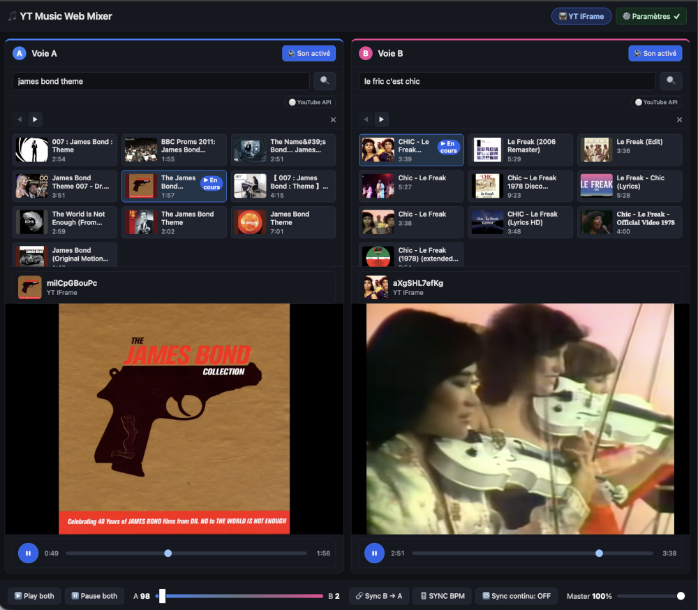
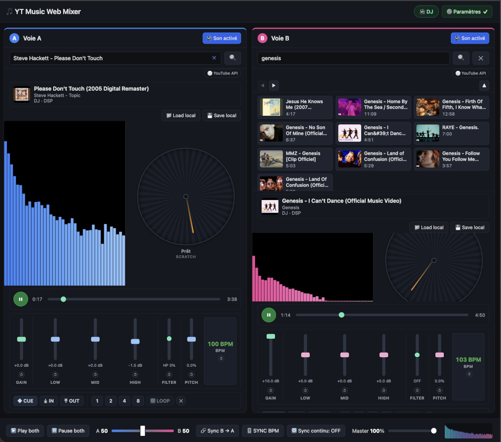
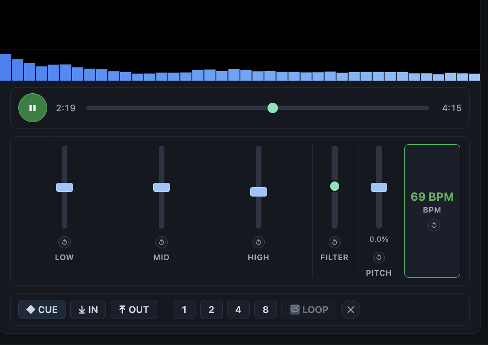
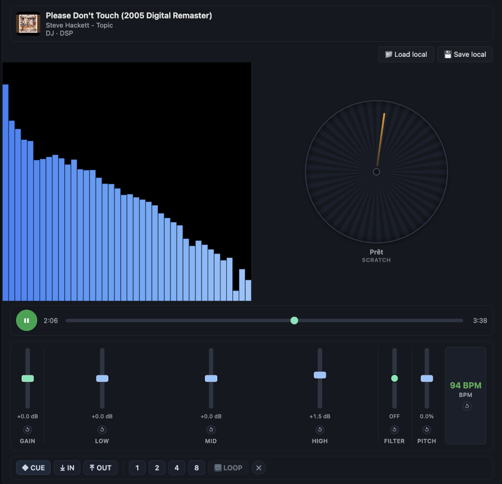

# 🎚️ Aide — Interface du Deck DJ

> yt-music-web-mixer — Guide de l'interface DJ

Cette page explique chaque contrôle du **deck DJ** (voie A ou B). Le mode DJ active le vrai mixage audio via Web Audio API : crossfade par `GainNode`, trim de voie, EQ 3 bandes, filtre DJ, pitch/tempo, détection BPM, **scratch platine vinyle**, **cue points & boucles**, **import/export de fichiers locaux**, et **visualiseur spectral**.

---

## 🔄 Les deux modes de l'application

L'application fonctionne en **dual mode** : un bouton dans l'en-tête permute les **deux decks ensemble** entre le mode DJ et le mode vidéo YouTube. Il n'y a pas de mode hybride (un deck DJ + un deck YT) — la bascule est globale.

### Mode YT IFrame (YouTube) 📺

> Le bouton d'en-tête affiche **📺 YT IFrame**. Lecteur vidéo YouTube officiel, mais le "mixage" se fait **uniquement par contrôle du volume** (`setVolume`) — pas de DSP possible sur l'iframe (origine croisée, pas de CORS). Les contrôles DJ (trim, EQ, filtre, pitch, BPM, scratch, cue/loop, visualiseur) sont masqués.

### Mode DJ (Audio / DSP) 🔊

> Le bouton d'en-tête affiche **🔊 DJ**. Le flux audio est extrait localement (backend `yt-dlp`) puis traité via **Web Audio API**. On perd la vidéo YouTube (audio-only) mais on gagne le vrai mixage : crossfade audio réel, trim, EQ, filtres, analyse spectrale, scratch vinyle, BPM, cue/loop. Le visualiseur spectral et la platine scratch remplacent la vidéo.

> 💡 **Pour passer de l'un à l'autre** : clique sur le bouton **🔊 DJ / 📺 YT IFrame** dans l'en-tête. Le mode « Auto » (résolution au démarrage) n'est atteignable que depuis la modal Paramètres.

---

## 🖼️ Focus : le bloc CUE & LOOP

Le bloc ci-dessus regroupe les boutons de navigation dans le morceau : **cue point**, **marqueurs de boucle**, **boucles de N beats**, et **activation/effacement de la boucle**.

---

## 📍 Vue d'ensemble d'un deck (mode DJ)

Chaque deck (voie A à gauche, voie B à droite) contient, de haut en bas :

| Zone | Rôle |
|------|------|
| **Recherche** | Champ de recherche YouTube (clé API) ou Piped (sans clé) + résultats. Bouton **✕** pour fermer les résultats. |
| **Now playing** | Miniature, titre, uploader, badge de mode (DJ · DSP / YT IFrame) |
| **Fichier local** | Deux boutons : **📁 Load local** (importer un fichier audio depuis le disque) et **💾 Save local** (télécharger le MP3 en cours) |
| **Lecteur + visualiseur + scratch** | Canvas spectre/waveform (remplace la vidéo YouTube en mode DJ) + **platine vinyle scratch** à droite |
| **Barre de transport** | ▶/⏸ lecture/pause, curseur de position, temps courant / durée |
| **Bloc DJ** (trim + EQ + filtre + pitch + BPM) | Fader **GAIN** (trim de voie), faders verticaux LOW/MID/HIGH, knob FILTER, fader PITCH, badge BPM |
| **Bloc CUE & LOOP** | Boutons de cue et boucles (détaillés ci-dessous) |

---

## 🎛️ Bloc DJ (trim + EQ + filtre + pitch + BPM)

### GAIN — Trim de voie (±10 dB)

Fader vertical par voie, de **−10 dB** à **+10 dB**, centré à 0 dB (neutre).

- Compense le **volume relatif** entre les deux voies avant le crossfader.
- Permet d'égaliser le niveau perçu de deux morceaux dont le mastering est différent (un morceau « fort » et un « faible »).
- Placé **avant le crossfader** : le trim n'interfère pas avec la courbe du crossfade.

> ⚠️ Utile quand les deux morceaux n'ont pas le même volume moyen : au lieu de déséquilibrer le crossfader, tu compenses avec le GAIN de la voie la plus faible. Double-clic = reset à 0 dB. Le bouton **↺** à côté fait pareil en un clic.

### EQ 3 bandes — `LOW` / `MID` / `HIGH`

Trois faders verticaux par voie, de **−12 dB** (bas = coupé) à **+12 dB** (haut = amplifié). Le centre (0 dB) est neutre.

- **LOW** : graves (sub, kick drum, basse) — 200 Hz
- **MID** : médiums (voix, mélodies, snare) — 1000 Hz
- **HIGH** : aigus (cymbales, transitoires, chapelet) — 4000 Hz

> Double-clic sur un fader = reset à 0 dB. Le petit bouton **↺** à côté fait pareil en un clic.

### Filtre DJ — `FILTER`

Un knob vertical, de **−1** (bas) à **+1** (haut), centré à 0 (bypass) :

- **Bas (−1)** : lowpass très fermé → son étouffé, on ne garde que les graves (200 Hz)
- **Centre (0)** : transparent, audio non modifié
- **Haut (+1)** : highpass très ouvert → on ne garde que les aigus (au-dessus de 5 kHz)

> Le knob balaie en échelle **logarithmique** : la sensation est régulière. Double-clic = bypass.

### Pitch / Tempo — `PITCH`

Fader vertical de **−8 %** à **+8 %**, centré à 0 %.

- Modifie la **vitesse de lecture** (`playbackRate`) sans changer la **hauteur** (pas d'effet "chipmunk") grâce à `preservesPitch`.
- Sert au **beatmatching** : ajuster le tempo de B pour le caler sur A.
- Le **BPM effectif** affiché dans le badge BPM tient compte du pitch (BPM × playbackRate).

> ⚠️ Ne fonctionne qu'en mode DJ. Double-clic = reset à 0 %.

### Badge BPM

Affiche le tempo détecté en temps réel, avec 3 états visuels :

| État | Couleur | Signification |
|------|---------|---------------|
| `idle` / `detecting` | 🔴 rouge (pulsé) | Acquisition en cours, pas encore de valeur fiable |
| `estimating` | 🟠 orange | BPM provisoire affiché (~2-3 s), affinage en arrière-plan |
| `locked` | 🟢 vert | BPM verrouillé, valeur fiable |

> Le bouton **↺** sous le badge relance le calcul (repart de zéro). La détection est **approximative** (±2-3 BPM) — les transitions et breaks peuvent fausser la mesure.

---

## 💿 Scratch / Platine vinyle (SCRATCH)

Chaque deck embarque une **platine vinyle tactile** (`.platter`) à droite du visualiseur. Le scratch est un vrai **scratch bidirectionnel** (avant/arrière, sample-accurate) utilisant un `AudioBufferSourceNode` — pas un simple déplacement de `currentTime` sur un `<audio>`.

### Comment ça marche

| Action | Comportement |
|--------|-------------|
| **Pointer down** (clic / toucher sur la platine) | Décode le PCM complet en mémoire (paresseux, 1 fois) → bascule la source audio du streaming vers le buffer scratch. |
| **Pointer move** (drag circulaire) | La vitesse angulaire (rad/s) du doigt contrôle le `playbackRate` du scratch : **tourner dans le sens horaire** = avance rapide, **anti-horaire** = recul. |
| **Pointer up** (relâchement) | Rebascule vers le streaming à la position finale du scratch. La lecture reprend si elle était active. |

### Détails techniques

- **1 tour complet** de la platine = **~1,8 s de lecture** (vinyle 33⅓ rpm). Le rapport est strict : plusieurs tours font avancer/reculer proportionnellement.
- **Préchargement automatique** : le buffer PCM est décodé en arrière-plan dès le premier `play()` du morceau. Au premier toucher, le scratch est **instantané** (pas d'attente de chargement).
- **État du badge** : `Prêt` → `Chargement…` / `↓ XX%` (décodage en cours) → `Scratch` (scratch actif) → `Erreur`.
- **Rotation visuelle** : le repère angulaire de la platine suit la position de lecture en temps réel, y compris **pendant le scratch** (aucun saut visuel au relâchement).
- **Taux max** : `playbackRate` limité à ±3× la vitesse normale (borne de sécurité).

### Contrôle du scratch

1. Pose le doigt (ou la souris) sur la **platine circulaire**.
2. Fais glisser en cercle : ta vitesse angulaire → vitesse du scratch (bidirectionnel).
3. Relâche : le son reprend là où tu as arrêté le scratch.

> ⚠️ Le scratch ne fonctionne qu'en **mode DJ** (mode Piped audio). En mode IFrame YouTube, la platine est masquée. Le buffer nécessite que le flux audio soit accessible (backend local `yt-dlp` ou Piped avec CORS).

---

## 💾 Load Local / Save Local

### 📁 Load Local — Importer un fichier audio

Chaque deck a un bouton **📁 Load local** qui permet d'ouvrir un fichier audio depuis le disque :

- **Formats supportés** : MP3, WAV, OGG, M4A, FLAC, AAC.
- Le fichier est chargé via le même pipeline que le streaming YouTube : lecture locale, décodage Web Audio, scratch, visualiseur, BPM, etc.
- **Métadonnées ID3** : le titre et l'artiste sont extraits des tags du fichier et affichés dans le "Now playing".
- **Cover art** : l'image de couverture ID3 (APIC) est extraite et affichée comme vignette.

> 💡 Utile pour mixer des fichiers que tu as déjà sur ton disque sans passer par YouTube. Tous les contrôles DJ (EQ, filtre, pitch, scratch, cue/loop) restent disponibles.

### 💾 Save Local — Sauvegarder le morceau en cours

Le bouton **💾 Save local** (à droite de "Load local") télécharge le morceau en cours sur le disque :

- **Fonctionne uniquement en mode DJ** (Piped audio) avec une source YouTube chargée.
- Le fichier est téléchargé via le backend local (`/api/download/{videoId}`) en MP3.
- **Nom de fichier** : `{titre}-{artiste}.mp3` (généré automatiquement, caractères interdits nettoyés).
- **Bouton désactivé** si :
  - Le fichier est déjà local (rien à sauvegarder)
  - Le mode IFrame est actif (pas de flux brut accessible)
  - Aucune source n'est chargée

> 💡 Utilise la fonctionnalité standard `showSaveFilePicker` du navigateur (Chrome 86+) ou un lien `<a download>` en fallback. Le fichier est téléchargé tel quel, sans transcodage.

---

## 🔁 Bloc CUE & LOOP — Détail des boutons

C'est la partie qui nous intéresse le plus. Voici chaque bouton, de gauche à droite :

### `◆ CUE` — Point de repère

Sauvegarde et rappelle une position dans le morceau.

| Action | Comportement |
|--------|-------------|
| **1er clic** (aucun cue défini) | Mémorise la position courante (`currentTime`). Le bouton devient vert (`is-set`). |
| **Clic suivant** (cue déjà défini) | Seek immédiat vers le point mémorisé. |
| **Double-clic** | Seek vers le cue **ET** lance la lecture (play depuis le cue). |

> Comportement type console DJ : tu calez un point de départ (intro, drop, premier beat), puis tu peux y revenir instantanément d'un seul clic.

### `⤓ IN` — Marqueur de début de boucle (Loop In)

Pose le **point d'entrée** de la boucle à la position courante.

- Le bouton s'allume en **orange** (`aria-pressed`) quand le marqueur est posé.
- Si tu poses un `IN` **après** un `OUT` existant, le `OUT` est automatiquement effacé (il doit toujours être après le `IN`).

### `⤒ OUT` — Marqueur de fin de boucle (Loop Out)

Pose le **point de sortie** de la boucle à la position courante.

- Le bouton s'allume en **orange** quand le marqueur est posé.
- Si tu poses un `OUT` **avant** un `IN` existant, le `IN` est automatiquement effacé.

> Une fois que **les deux** marqueurs `IN` et `OUT` sont posés (et que `OUT > IN`), le bouton **🔁 LOOP** devient actif (utilisable).

### `1` / `2` / `4` / `8` — Boucle de N beats

Pose automatiquement une boucle de **1, 2, 4 ou 8 beats** à partir de la position courante.

- La **durée d'un beat** est calculée à partir du **BPM détecté** (`60 / BPM`).
- Si le BPM est encore en cours d'estimation, on utilise le **BPM provisoire** (orange).
- Si aucun BPM n'est disponible (rouge, pas encore de beats accumulés), un message t'invite à patienter : « BPM non détecté — impossible de calibrer la boucle. »
- La boucle est **immédiatement activée** (pas besoin de cliquer `🔁 LOOP` après).

> Exemple : BPM = 128 → 1 beat = 0,469 s. Le bouton `4` crée une boucle de ~1,875 s à partir de maintenant.

### `🔁 LOOP` — Activation / désactivation de la boucle

Bouton **toggle** : active ou désactive la boucle A↔B définie par `IN` et `OUT`.

- **Grisé** (désactivé) tant que les deux marqueurs ne sont pas posés.
- **Bleu** (`aria-pressed="false"`) : boucle définie mais inactive.
- **Vert** (`aria-pressed="true"`) : boucle **active** — l'audio rejoue depuis `IN` dès qu'il atteint `OUT`.

> La surveillance tourne à ~60 Hz (`requestAnimationFrame`), donc la transition est quasi **sample-accurate** (plus fiable qu'un `timeupdate` qui ne se déclenche qu'~4 fois par seconde).

### `✕` — Effacer la boucle (Clear)

Le petit bouton rond **à droite**.

- Efface **les deux** marqueurs `IN` et `OUT` de cette voie.
- Désactive la boucle active.
- Les marqueurs sont aussi retirés du `localStorage`.

> C'est le bouton "reset complet" de la boucle. À utiliser quand tu veux repartir d'une boucle propre, ou quand tes marqueurs ne sont plus pertinents (changement de section du morceau, etc.).

---

## ⚙️ Paramètres — Crossfade progressif

Depuis la modal **Paramètres** (bouton ⚙️ dans l'en-tête), tu peux configurer le **crossfade progressif** :

| Réglage | Défaut | Description |
|---------|--------|-------------|
| **Palier** | 100 % | Pourcentage de la distance restante parcouru à chaque pas. 100 % = instantané. Plus bas = transition plus longue. |
| **Intervalle** | 0 ms | Temps entre deux pas (ms). 0 ms = instantané. Plus haut = transition plus longue et plus lisse. |

> Exemple : palier = 20 %, intervalle = 50 ms → le crossfade atteint sa cible en ~5 pas étalés sur 250 ms, pour une transition douce sans à-coup. Palier = 100 % ou intervalle = 0 ms = comportement instantané.

### 🔄 Auto XF — case à cocher dans la barre de mixage

À droite du bouton **⏸️ Pause both**, une case **🔄 Auto XF** permet d'**armer** (cochée) ou **désarmer** (décochée) le crossfade progressif, dans les **deux modes** (DJ et YT IFrame) :

| État | Comportement du slider crossfade |
|------|----------------------------------|
| **Décochée** (défaut) | Saut **instantané** à la position demandée (mode Piped, le ramping fluide est géré nativement par Web Audio) |
| **Cochée** | La position demandée est atteinte par **paliers** progressifs, en utilisant le **palier %** et **l'intervalle** configurés dans Paramètres |

- **Armé + déplacement du slider** → le crossfade descend/remonte par paliers jusqu'à la nouvelle position cible (au lieu d'un saut).
- **Changement de cible pendant le ramp-up** → la cible est mise à jour ; la rampe repart de la position courante.
- **Désarmer pendant un ramp-up** (décochée) → la cible est atteinte immédiatement.
- **Persistance** : l'état de la case est sauvegardé dans le `localStorage` et restauré au démarrage.

---

## 🎛️ Visualiseur master

La barre de mixage (en bas) contient un **visualiseur spectral** global (canvas) qui affiche le spectre audio du **mix final** (post-crossfade, post-master volume). Chaque deck a aussi son propre visualiseur (spectre ou waveform) dans le bloc lecteur, branché **avant le crossfader** (toujours actif même si le deck est coupé par le crossfade).

---

## 💾 Persistance

Les réglages suivants sont sauvegardés dans le `localStorage` et restaurés au prochain démarrage :

| Réglage | Clé | Comportement au reload |
|---------|-----|------------------------|
| EQ Low | `eqLowA` / `eqLowB` | Restauré ✅ |
| EQ Mid | `eqMidA` / `eqMidB` | Restauré ✅ |
| EQ High | `eqHighA` / `eqHighB` | Restauré ✅ |
| Gain (trim) | `gainA` / `gainB` | Restauré ✅ |
| Filtre DJ | `djFilterA` / `djFilterB` | Restauré ✅ |
| Pitch | `pitchA` / `pitchB` | Restauré ✅ |
| Crossfade | `crossfade` | Restauré ✅ |
| Auto XF (case armée) | `autoXf` | Restauré ✅ |
| Volume master | `masterVolume` | Restauré ✅ |
| Cue point | `cueA` / `cueB` | Restauré ✅ |
| Loop In | `loopInA` / `loopInB` | Restauré ✅ |
| Loop Out | `loopOutA` / `loopOutB` | Restauré ✅ |
| Boucle active | — | **Non réactivée** ❌ (une boucle qui se relance toute seule au démarrage serait surprenante — tu dois cliquer `🔁 LOOP` pour la relancer) |

> ⚠️ Au changement de morceau, **les cue points et marqueurs de boucle sont effacés** : leurs positions (en secondes) ne correspondent plus au nouveau morceau. Le buffer scratch est aussi invalidé.

---

## ⚠️ Limites & points d'attention

- **Mode DJ uniquement** : le bloc CUE & LOOP, le scratch, le trim, et les contrôles DJ sont masqués en mode IFrame YouTube.
- **BPM approximatif** (±2-3 BPM) : les boucles de N beats peuvent être légèrement décalées sur des morceaux à tempo variable (transitions, breaks).
- **Loop de N beats sans BPM** : si le détecteur n'a pas encore de valeur, attends quelques secondes que le BPM provisoire (orange) s'affiche.
- **Deux boucles actives** (A et B) : tu peux avoir une boucle active sur chaque voie simultanément — utile pour caler une transition.
- **Cue + boucle** : les deux sont indépendants. Le cue n'est pas affecté par la boucle ; tu peux boucler une section et revenir à ton cue d'un clic.
- **Scratch** : nécessite que le buffer audio complet soit décodé en mémoire. Un préchargement automatique est lancé dès la première lecture, mais le premier scratch peut être retardé si le buffer n'est pas prêt (état « Chargement… » sur la platine).
- **Save local** : ne fonctionne qu'en mode DJ avec une source YouTube. Les fichiers locaux ne peuvent pas être sauvegardés (ils le sont déjà).
- **Crossfade progressif** : le palier et l'intervalle sont réglables dans les Paramètres. Un crossfade instantané (palier = 100 %) reste le comportement par défaut.

---

## 🎯 Cas d'usage typiques

### 1. Caler une transition (beatmatch)
1. Charge le morceau A, laisse le BPM se verrouiller (vert).
2. Charge le morceau B, laisse le BPM se verrouiller.
3. Ajuste le **GAIN** de chaque voie si les morceaux n'ont pas le même volume.
4. Clique **🎚️ SYNC BPM** dans la barre de mixage → le tempo de B s'ajuste (±8 %) pour matcher A.
5. Utilise **🔗 Sync B → A** pour caler la position.
6. Fais glisser le **crossfade** de A vers B.

### 2. Boucler un drop
1. Attends le début du drop, clique **⤓ IN**.
2. À la fin du drop, clique **⤒ OUT**.
3. Clique **🔁 LOOP** → le drop tourne en boucle.
4. Mix par-dessus avec l'autre voie, puis clique **🔁 LOOP** pour relâcher.

### 3. Boucle de 4 beats improvisée
1. Repère le premier beat d'une phrase.
2. Clique **4** → une boucle de 4 beats (1 mesure) se crée et s'active immédiatement.
3. Ajuste au besoin : re-clique **4** depuis une nouvelle position, ou **✕** pour effacer.

### 4. Revenir à un point précis (cue)
1. À l'intro, clique **◆ CUE** (le bouton passe en vert).
2. Laisse le morceau avancer.
3. Clique **◆ CUE** → retour instantané à l'intro.
4. **Double-clic** → retour **ET** lecture.

### 5. Effet scratch sur un breakdown
1. Pose un **◆ CUE** juste avant le drop.
2. Pendant le breakdown, touche la **platine** du deck B.
3. Frotte en cercle pour scratcher l'échantillon.
4. Relâche, puis clique **◆ CUE** pour revenir au point de départ.
5. Lance le drop au bon moment.

### 6. Mixer un fichier local avec un stream YouTube
1. Clique **📁 Load local** sur la voie A, sélectionne un MP3.
2. Cherche un morceau sur YouTube dans la voie B.
3. Les deux passent par le même pipeline audio : EQ, filtre, crossfade, scratch, BPM, cue/loop — tout est disponible.
4. Clique **💾 Save local** sur la voie B pour télécharger le morceau YouTube sur ton disque.
