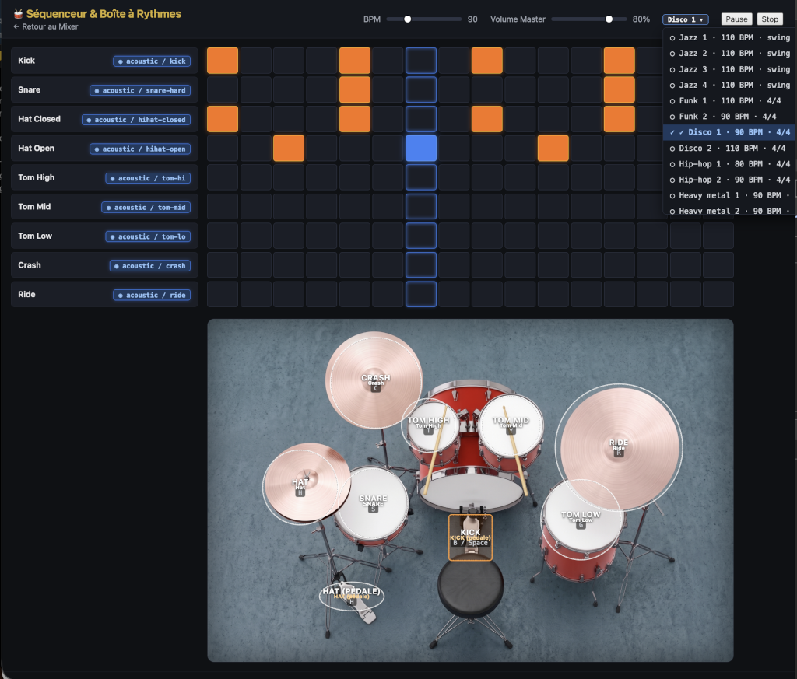

# 🥁 Sequencer & Drum Machine — User Guide

The Sequencer is an integrated module of the YT Music Web Mixer that transforms your browser into a full-featured drum machine. It combines a step-by-step programming matrix with an interactive drum kit interface.

## 🚀 How to Access
From the main Mixer page, click the **🥁 Sequencer** button in the header to open the interface.

---

## 🖼️ UI Overview

*(Legend: From top to bottom $\rightarrow$ Transport & Presets $\rightarrow$ Programming Matrix $\rightarrow$ Interactive Drum Kit)*

---

## 🎛️ Feature Guide

### 1. The Step Sequencer Matrix
The grid allows you to compose your own rhythms over 16 steps (sixteenth notes).

- **Programming**: Click a cell to activate or deactivate a note. A cell lit up in blue will be triggered when the playhead passes over it.
- **Tracks**: You have 9 instruments available (Kick, Snare, Hats, Toms, Crash, Ride).
- **Playhead**: The yellow cursor indicates the current playback position in real-time.
- **BPM**: Adjust the rhythm speed using the slider (from 40 to 240 BPM).

### 2. The Interactive Drum Kit (Top-View)
Below the grid, you'll find a top-down view of your drum kit.

- **Direct Hit**: Click on a drum or cymbal to trigger the sound instantly.
- **Keyboard Shortcuts**: Play like a pro using your keyboard:
  - `B` or `Space` $\rightarrow$ Bass Drum (Kick)
  - `S` $\rightarrow$ Snare Drum
  - `H` $\rightarrow$ Hi-hat
  - `T`/`Y`/`G` $\rightarrow$ Toms (High, Mid, Low)
  - `C` $\rightarrow$ Crash
  - `R` $\rightarrow$ Ride
- **Hi-hat Pedal**: Click the pedal (bottom-left) to toggle between **UP** (open) and **DOWN** (closed) states. This modifies the hi-hat sound, whether triggered via the grid or the keyboard.

### 3. "Rhythms" Presets
Don't start from scratch! Use the pre-defined rhythms inspired by the most common genres.

- **Rhythms Menu**: Click the **Rhythms ▾** button to open the dropdown menu.
- **Selection**: Choose from various styles (Pop rock, Jazz, Funk, Disco, Hip-hop, Heavy metal).
- **Impact**: Loading a preset automatically adjusts the grid, the BPM, and the swing mode (specifically for Jazz).

### 4. Sound Customization
Each track has a configuration menu:
- **Synthesis**: Sound generated in real-time by Tone.js.
- **Samples**: Use high-quality WAV files (Acoustic or Electronic kits).
